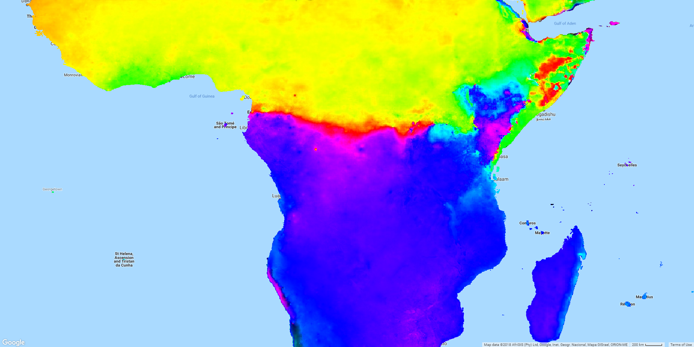

# Portfolio

#### *A few of my most interesting pieces of work*

---

## Remote Sensing and Google Earth Engine 
I've spent quite a bit of time over the last few years working with <a href="https://earthengine.google.com" target="_blank">Google Earth Engine</a>. It's really sparked my interest in remote sensing and is an incredible resource for working with the massive data volumes involved, as well as for publishing analyses. This section lists just a few of the most inspiring pieces of work I've done with it.

---

**[Accessibility Mapping Tool](/pages/accessibility)**
 Making scientific research outputs more accessible by lowering the knowledge barrier for interacting with the results

---
**[Mapping paddy rice growth in Google Earth Engine](/pages/rice)**
 Implementing complex processing chains on raster data, using Google Earth Engine to vastly increase the feasible scope of analysis

---
**[Investigating seasonality of rainfall in Google Earth Engine](/pages/seasonality)**
 Quickly processing very large source datasets to produce maps characterising continental-scale patterns of rainfall, supporting modelling of malaria seasonality

  

---

## High-performance raster data processing
Within MAP (the research group I work in) we use a lot of remotely-sensed and other raster datasets as covariates to our geostatistical models. I'm responsible for producing these, and we hold many thousands of gigapixel-scale images. 

More often than not I write the algorithms needed using Cython, an extension to Python which generates C code from Python. This section describes some of the more complex code I've produced and there's a presentation I gave explaining why I did it this way.

**[Gapfilling planetary-scale raster datasets](/pages/gapfilling)**
 High-performance Python implementation of large scale raster processing algorithms

**<a href="https://github.com/harry-gibson/raster-processing-theory" target="_blank">Writing Performant Raster Processing Code</a>**
 
A training presentation given to colleagues, introducing computer-science concepts 
   relevant to writing high-performance code for processing raster datasets
  

---

## Advanced geoprocessing and spatial data manipulation
In my current role I primarily work with raster-format geospatial data, as that is what our models are all based on. 

However I also have extensive experience in designing and implementing advanced geoprocessing workflows for vector-format geospatial data and my computer science background allows me to think laterally about appropriate algorithms for many tasks, whether or not they are available in the toolboxes of off-the-shelf GIS software. As well as writing these from scratch and using desktop GIS software, I have for many years been an expert user of FME (Feature Manipulation Engine) for this and many other purposes.

**[Generation of a national Continuous Defence Line for flood modelling](/pages/fme.md)**
 Using FME to design and implement a complex geoprocessing workflow for the automation of a major GIS editing and integration task

  

---
## Other data processing and extraction
I don't just use raster data, or even geospatial data, in my work. We use raster data as covariates (predictors) in our models but we also need response data - the thing we are trying to model. One of the major sources of this is national survey data from the DHS - I've written code and FME workbenches that mean we can draw on all available survey data without having to manually process each new survey.

**[Demographic and Health Survey data](/pages/dhs-survey-data)**
 Making it possible to process the whole body of DHS survey data enabling more and better usage of the data across our research
  

---

## Outreach

**[Web mapping applications for science communication](/pages/online-tools)**

Creating a rich, interactive web mapping presentation to accompany the launch of a major publication

---
## Older work

**<a href="https://github.com/harry-gibson/js2shapefile" target="_blank">Creating shapefiles in Javascript</a>**
 
Way back in 2012 I was working at the <a href="https://www.ceh.ac.uk/" target="_blank">Centre for Ecology and Hydrology</a>, in the <a href="https://nrfa.ceh.ac.uk/" target="_blank">National River Flow Archive</a>. I created a <a href="https://github.com/harry-gibson/racquel" target="_blank">Javascript application</a> using the <a href="https://developers.arcgis.com/javascript/" target="_blank">ESRI Javascript API</a> and ArcGIS Server, to allow colleagues to interact with the wealth of geospatial data we held about UK river catchments.

Perhaps the most interesting part about this was the <a href="https://github.com/harry-gibson/js2shapefile" target="_blank">JS2Shapefile</a> library I wrote. This used the nascent ability of browsers of the day to work with binary data, to create shapefiles directly in the browser from features displayed on the web map. There's definitely better ways of doing this now, but I think it's interesting to see what could be done that long ago!

---

Page template forked from <a href="https://github.com/evanca/quick-portfolio">evanca</a>

<!-- Remove above link if you don't want to attibute -->
